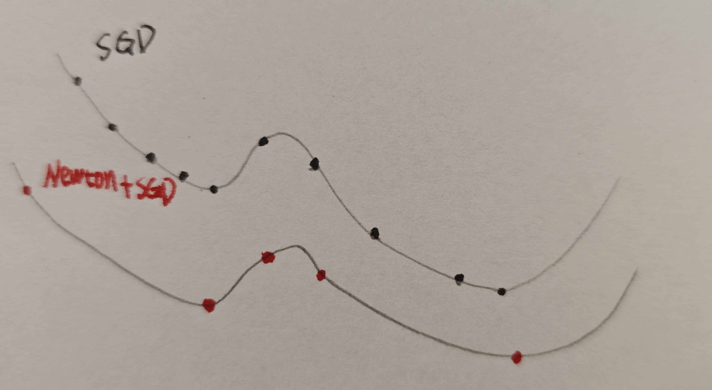

# Accelerating Optimization: Combining Newton's Method with SGD

It is well known that Newton's method can converge to the minimum of a quadratic function in a single step due to its usage of second-order derivative (curvature) information. Captivated by this rapid convergence, a hybrid optimization approach came to my mind when I was attending a lecture on optimization techniques:

What if we directly descend from our starting position to a local minimum in a single step using Newton's method, and then perform several steps of Stochastic Gradient Descent (SGD) to escape that local basin? Once the model escapes, we apply Newton's method again to instantly jump to the next local minimum.

The proposed optimization loop proceeds as follows:
1. **Newton Step**: Use Newton's method (incorporating Hessian information) to jump directly to the local minimum of the current basin in a single step.
2. **SGD Exploration**: Perform a number of SGD updates to inject noise and escape the current local basin.
3. **Newton Step**: Apply Newton's method again to converge immediately to the next local minimum.
4. **Repeat**: Iterate this loop throughout training.

As illustrated in the diagram, standard SGD requires many small, incremental steps to traverse valleys and reach the minimum, whereas the hybrid **"Newton + SGD"** approach can navigate the optimization landscape much faster.

### The Challenge: Selecting the Right Number of SGD Steps

However, a key challenge of this method is determining the optimal number of SGD steps to perform after each Newton update.

Looking at the diagram from left to right, if we only apply a single SGD step:
1. The **second point** (red) represents the local minimum reached after the first Newton step.
2. The **third point** (red) is the position after exactly one SGD update.

From this third point, it is clear that the optimizer is still within the attractive basin of the second point. If we were to immediately apply Newton's method again, the step would simply bring the model right back to the second point (the local minimum we just escaped). Therefore, we must apply multiple SGD steps to ensure the model travels far enough to enter a new basin before invoking Newton's method again.
