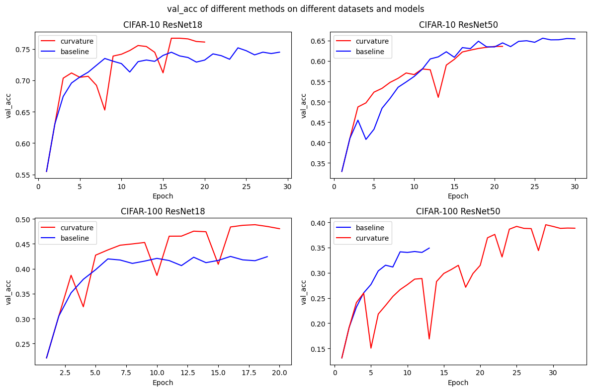
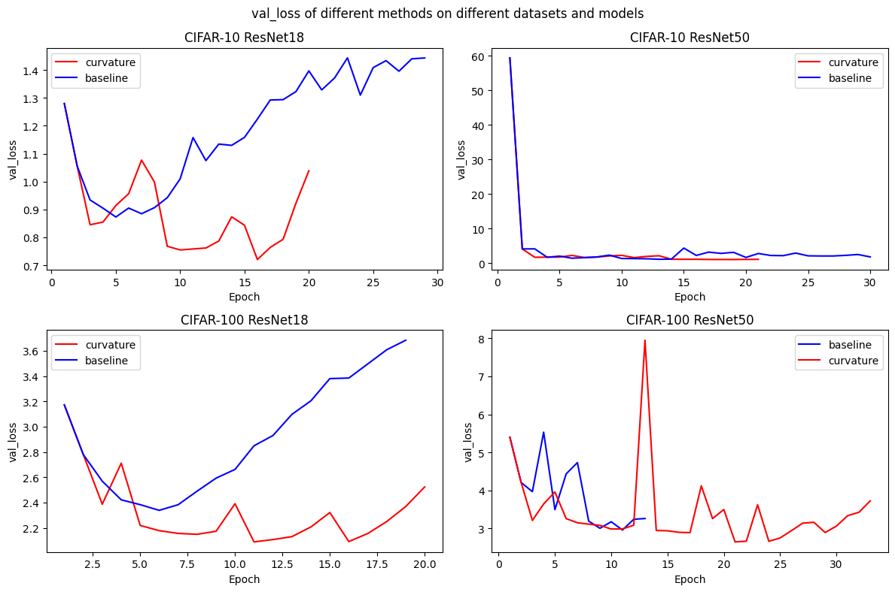

In the course "Optimization in Deep Learning", it was mentioned that the maximum eigenvalue of a quadratic form represents curvature. A larger curvature implies that the local minimum the model has entered might suffer from poor generalization performance. Instead, we want to find a flatter minimum—one with smaller curvature.

### Method
We can implement the following strategy:

1. Curvature Detection: Monitor the maximum eigenvalue of the Hessian matrix with respect to the loss function at the model's current position in the parameter space, ONLY at the end of each epoch of training, not each step.
2. Perturbation and Escape: If the maximum eigenvalue exceeds a predefined threshold, we intentionally make the optimization updates unstable (by increasing the learning rate and decreasing the batch size). This forces the model to escape the sharp local minimum. Consequently, we should observe the validation loss temporarily spike before decreasing again.
3. Repeat this process(step1&step2) dynamically:

    (a)  When the curvature increases, increase the learning rate and decrease the batch size to introduce noise.
    
    (b) When the curvature decreases, decrease the learning rate and increase the batch size to stabilize the updates. This ensures that once the model reaches a flat and broad minimum, it can converge faster without excessive oscillation.

### Preliminary Results
I tested this approach using SGD on small-scale vision models. On both the CIFAR-10 and CIFAR-100 datasets, it yielded a 2% to 3% improvement in validation accuracy.

The reason the number of epochs varies for each experiment here is that I've set the convergence criterion as follows: the validation set accuracy must fluctuate by less than 1% over a span of five epochs.

### Scaling to Large Models via Shampoo
While pre-learning the Shampoo optimizer today(June 10, 2026), I noticed that it has already leveraged second-order information. The authors mentioned that computing second-order information is prohibitively expensive in large-scale model scenarios. This inspired me(trying to earn survival space for my idea...): we could potentially estimate the maximum eigenvalue of the Hessian matrix by utilizing the two preconditioner matrices, A and B, maintained by Shampoo. According to an LLM I consulted, the computational overhead of calculating the maximum eigenvalue on top of the existing Shampoo framework would be virtually negligible.