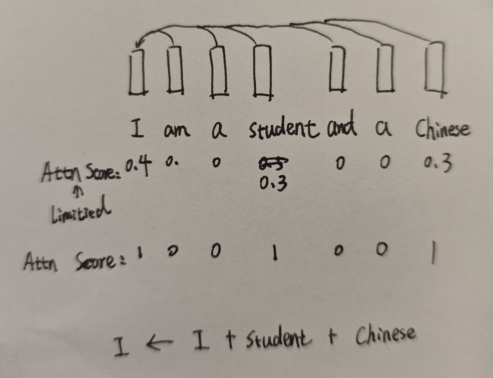

# Unbinding the Attention Budget: Rethinking Softmax in Self-Attention

In standard self-attention mechanisms, the attention scores are normalized using the softmax function. By definition, this allocates a fixed "attention budget" for each token—meaning the attention weights assigned to all other tokens (including itself) must sum to exactly 1. While this sum-to-one constraint might help maintain numerical stability and prevents activation values from exploding, it also introduces a limitation.

Imagine a scenario where a token needs to aggregate information from its context. If multiple surrounding tokens contain highly critical, complementary information that the current token wants to fully absorb, the softmax normalization acts as a bottleneck. It artificially constrains the representation capacity by forcing the token to distribute its limited attention budget.

For example, consider the sentence **"I am a student and a Chinese"** and focus on the modeling of the token **"I"**. Here, the tokens **"student"** and **"Chinese"** are both highly important and informative for representing **"I"**. However, under the softmax constraint, the token **"I"** can allocate at most a fraction of its attention budget (e.g., 30% each) to these crucial context tokens, as the remaining budget is split across other tokens and itself.

What if we removed this sum-to-one constraint and instead bound the attention of each token pair to a local range of [0, 1] (where 0 means complete disregard and 1 means maximum importance)? By applying an independent activation (such as a sigmoid function) to each attention score rather than softmax, a token could freely import all relevant information from multiple key sources simultaneously without dilution. 

Although removing softmax could lead to numerical instability or exploding activations, we can mitigate this issue by applying standard normalization techniques elsewhere in the block—such as **Batch Normalization (BN)** or **Layer Normalization (LN)**—to stabilize the outputs.
